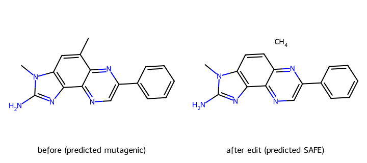
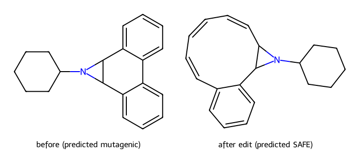
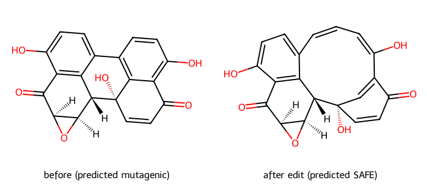

# Case studies: distilled HGTM-CBR ensemble on TDC AMES test set

All three molecules are predicted MUTAGENIC by the K=5 distilled ensemble; for each, the clause-driven greedy recourse search finds a ≤3-edit transformation that flips the prediction to SAFE while keeping the resulting molecule RDKit-valid, Lipinski-compliant, and SAscore < 6.

## Case 1: mol_22

- **Before** SMILES: `Cc1cc2c(nc(N)n2C)c2ncc(-c3ccccc3)nc12`
- **Prediction before:** MUTAGENIC (margin +156)
- **Firing clauses (union over 5 ensemble members):** 1802
- **Edit candidates considered:** 47
- **Edits applied:**
  - `remove_bond` indices=(0, 1)
- **After** SMILES: `C.Cn1c(N)nc2c3ncc(-c4ccccc4)nc3ccc21`
- **Prediction after:** SAFE (margin -511)
- **Validity after edit:** sanitize_ok=True, lipinski_ok=True, sa_score=2.49, sa_ok=True, overall_ok=True

## Case 2: mol_31

- **Before** SMILES: `c1ccc2c(c1)-c1ccccc1C1C2N1C1CCCCC1`
- **Prediction before:** MUTAGENIC (margin +646)
- **Firing clauses (union over 5 ensemble members):** 1407
- **Edit candidates considered:** 46
- **Edits applied:**
  - `remove_bond` indices=(3, 4)
- **After** SMILES: `C1=CC=CC2C(c3ccccc3C=C1)N2C1CCCCC1`
- **Prediction after:** SAFE (margin -918)
- **Validity after edit:** sanitize_ok=True, lipinski_ok=True, sa_score=4.11, sa_ok=True, overall_ok=True

## Case 3: mol_85

- **Before** SMILES: `O=C1C=C[C@]2(O)c3c(ccc(O)c31)-c1ccc(O)c3c1[C@H]2[C@H]1O[C@H]1C3=O`
- **Prediction before:** MUTAGENIC (margin +244)
- **Firing clauses (union over 5 ensemble members):** 1894
- **Edit candidates considered:** 50
- **Edits applied:**
  - `remove_bond` indices=(6, 7)
- **After** SMILES: `O=C1C=C[C@]2(O)C=C1C(O)=CC=Cc1ccc(O)c3c1[C@H]2[C@H]1O[C@H]1C3=O`
- **Prediction after:** SAFE (margin -147)
- **Validity after edit:** sanitize_ok=True, lipinski_ok=True, sa_score=5.98, sa_ok=True, overall_ok=True
